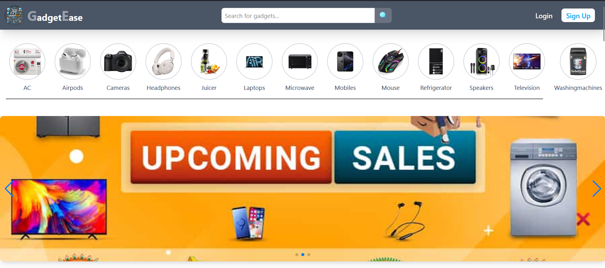
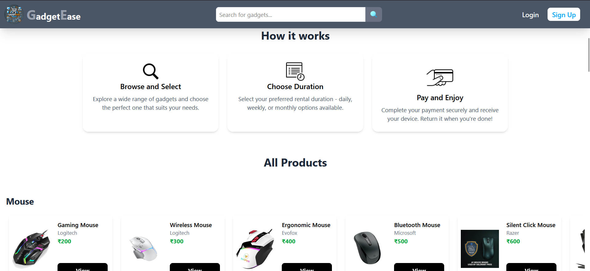
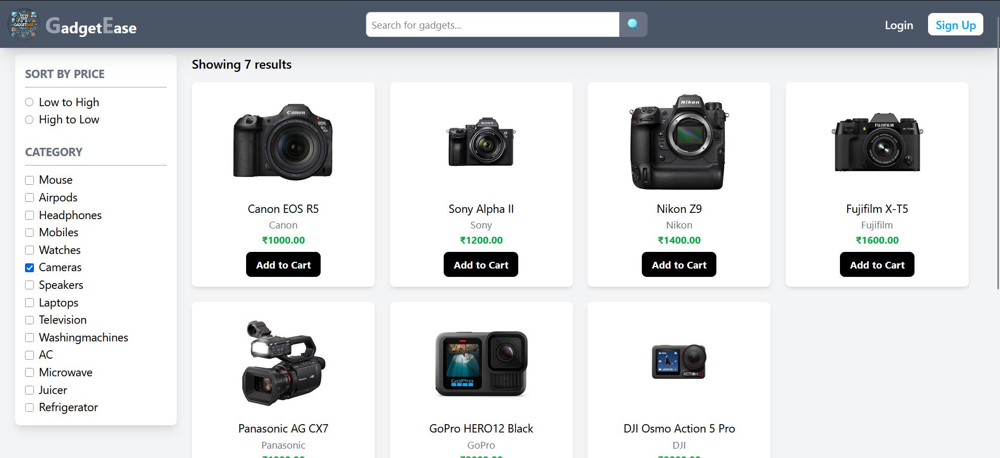
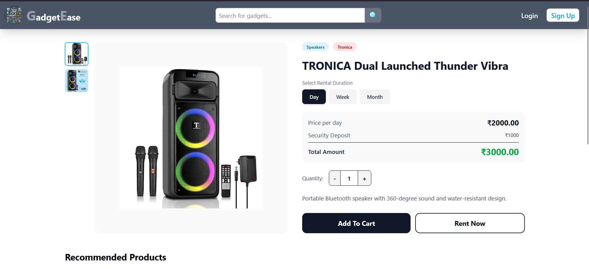

# GadgetEase - Gadget Rental E-Commerce Platform

A production-grade, fully responsive full-stack web application for renting electronic gadgets with flexible rental durations (daily, weekly, monthly), integrated Stripe payments, real-time notifications, email alerts, invoice generation, and an admin dashboard.


## Screenshots






## Features

### Customer Features
- **Browse Products** — View gadgets by category with full-text server-side search
- **Debounced Search** — 300ms debounced search powered by MongoDB text indexes with paginated results
- **Dynamic Categories** — Categories fetched from the database with product images
- **Product Details** — Detailed product view with multiple images, rental duration selection, and quantity control
- **Reviews & Ratings** — Verified-purchase review system with star ratings (only users with delivered orders can review)
- **Shopping Cart** — Add, update quantity, and remove items with real-time cart count badge
- **Wishlist** — Save favorite products with heart toggle on product cards and detail page, dedicated wishlist page
- **Product Comparison** — Compare up to 3 products side-by-side with price highlighting and floating compare bar
- **Checkout with Stripe** — Secure payment via Stripe Checkout hosted page
- **Rental Management** — Track rental start/end dates, days remaining, and request returns
- **Order Tracking** — View order history with "Active Rentals" and "Past Rentals" tabs
- **Invoice PDF Download** — Generate and download professional PDF invoices for paid orders
- **Email Notifications** — Order confirmation and status update emails with styled HTML templates
- **Address Management** — Save, select, and manage multiple shipping addresses in profile
- **User Authentication** — JWT-based login/signup with avatar selection
- **Password Management** — Change password from profile + forgot password flow with email reset link
- **Dark Mode** — System-aware dark mode toggle with localStorage persistence across all pages
- **Real-Time Notifications** — Socket.io-powered notifications for order status updates
- **Toast Notifications** — Real-time feedback for all user actions (success, error, warning)

### Admin Features
- **Dashboard** — Overview stats (users, orders, products, revenue) with recent orders table
- **Live Alerts** — Real-time new order notifications via Socket.io with auto-refresh
- **Manage Products** — CRUD operations with multi-image URL support and pagination
- **Manage Orders** — View all orders, update status, process returns, and refund deposits
- **Manage Users** — View and delete users with pagination
- **Responsive Sidebar** — Collapsible sidebar with hamburger toggle on mobile

### Security & API
- **Input Validation** — express-validator on all endpoints
- **Rate Limiting** — 100 req/min general, 5 req/min for login
- **Security Headers** — Helmet.js for HTTP security headers
- **Request Logging** — Morgan for structured request logging
- **API Documentation** — Swagger/OpenAPI docs at `/api-docs`

### Performance & UX
- **Lazy Loading** — All page components loaded with React.lazy() + Suspense for code splitting
- **Error Boundary** — Graceful crash recovery at app and page level with user-friendly error UI
- **Loading Skeletons** — Animated skeleton screens replacing spinners for products, product details, and orders
- **Fully Responsive** — Mobile-first design with hamburger menu, responsive grids, stacking layouts, and touch-friendly scrolling (320px to 4K)

## Tech Stack

### Backend
- **Runtime:** Node.js
- **Framework:** Express.js v5
- **Database:** MongoDB with Mongoose ODM
- **Authentication:** JWT (JSON Web Tokens)
- **Payment:** Stripe Checkout API
- **Real-Time:** Socket.io
- **Security:** Helmet, express-rate-limit, express-validator
- **Logging:** Morgan
- **Email:** Nodemailer (order confirmation + status updates + password reset)
- **PDF:** PDFKit (invoice generation)
- **Docs:** Swagger (swagger-jsdoc + swagger-ui-express)
- **Password Hashing:** bcryptjs

### Frontend
- **Library:** React 19
- **Build Tool:** Vite
- **Styling:** Tailwind CSS v4 (with dark mode + responsive breakpoints)
- **Routing:** React Router DOM v7 (with lazy loading)
- **HTTP Client:** Axios with auth interceptor
- **Real-Time:** Socket.io-client
- **Icons:** React Icons (Bootstrap, Ant Design, Heroicons)
- **Notifications:** React Toastify
- **Animations:** Lottie React, Swiper

## Project Structure

```
GadgetEase/
├── backend/
│   ├── config/
│   │   ├── database.js            # MongoDB connection
│   │   ├── mailer.js              # Nodemailer: reset, order confirm, status emails
│   │   └── swagger.js             # OpenAPI 3.0 spec definition
│   ├── controllers/
│   │   ├── adminController.js     # Dashboard, returns, management + status emails
│   │   ├── cartController.js      # Cart operations
│   │   ├── orderController.js     # Order CRUD, returns, invoice PDF generation
│   │   ├── paymentController.js   # Stripe payment + rental dates + confirmation email
│   │   ├── productController.js   # Product CRUD, search & categories
│   │   ├── reviewController.js    # Verified-purchase reviews
│   │   ├── userController.js      # Auth, profile, change/reset password
│   │   └── wishlistController.js  # Wishlist toggle
│   ├── middleware/
│   │   ├── authMiddleware.js      # JWT verification
│   │   ├── adminMiddleware.js     # Admin role check
│   │   └── validators.js          # express-validator chains for all routes
│   ├── models/
│   │   ├── Cart.js
│   │   ├── Order.js               # Includes rental dates & return status
│   │   ├── Product.js             # Text index for search
│   │   ├── Review.js              # Rating 1-5 with unique user+product
│   │   ├── User.js                # Includes password reset token fields
│   │   └── Wishlist.js
│   ├── routes/
│   │   ├── adminRoutes.js
│   │   ├── cartRoutes.js
│   │   ├── orderRoutes.js         # Includes invoice download endpoint
│   │   ├── paymentRoutes.js
│   │   ├── productRoutes.js       # Swagger-annotated
│   │   ├── reviewRoutes.js
│   │   ├── usersRoutes.js         # Swagger-annotated + change-password
│   │   └── wishlistRoutes.js
│   ├── scripts/
│   │   └── addProducts.js         # Database seeding script
│   ├── .env
│   ├── server.js                  # Express + Socket.io entry point
│   └── package.json
│
├── frontend/
│   ├── public/
│   │   └── Logo.jpg
│   ├── src/
│   │   ├── api/
│   │   │   └── axiosInstance.js    # Axios config with auth interceptor
│   │   ├── assets/
│   │   │   └── drone.json         # Lottie animation
│   │   ├── components/
│   │   │   ├── Categories.jsx     # Responsive category carousel
│   │   │   ├── CompareBar.jsx     # Floating comparison bar (responsive)
│   │   │   ├── ErrorBoundary.jsx  # Graceful error catch with recovery UI
│   │   │   ├── Footer.jsx         # Responsive footer
│   │   │   ├── Header.jsx         # Responsive nav with hamburger menu
│   │   │   ├── PageLoader.jsx     # Suspense fallback spinner
│   │   │   ├── ProductList.jsx    # Responsive product grid with wishlist & compare
│   │   │   ├── Slideshow.jsx      # Hero slideshow
│   │   │   ├── ToastMessage.jsx   # Toast notification helpers
│   │   │   └── skeletons/
│   │   │       ├── ProductCardSkeleton.jsx
│   │   │       ├── ProductDetailSkeleton.jsx
│   │   │       └── OrderSkeleton.jsx
│   │   ├── context/
│   │   │   ├── Usercontext.jsx    # User auth state
│   │   │   ├── cartContext.jsx    # Cart state
│   │   │   ├── SearchContext.jsx  # Debounced search state
│   │   │   ├── WishlistContext.jsx # Wishlist state
│   │   │   ├── SocketContext.jsx  # Real-time notifications
│   │   │   ├── CompareContext.jsx # Product comparison state (localStorage)
│   │   │   └── ThemeContext.jsx   # Dark mode state (localStorage)
│   │   ├── pages/
│   │   │   ├── Cart.jsx           # Responsive cart with stacking layout
│   │   │   ├── CategoryPage.jsx   # Responsive filters + grid
│   │   │   ├── Checkout.jsx       # Responsive checkout form
│   │   │   ├── ComparePage.jsx    # Scrollable comparison table
│   │   │   ├── ForgotPassword.jsx
│   │   │   ├── Home.jsx           # Search results + product grid
│   │   │   ├── Login.jsx          # Responsive auth form
│   │   │   ├── MyOrders.jsx       # Active/Past tabs + invoice download
│   │   │   ├── NotFound.jsx       # 404 page
│   │   │   ├── PaymentSuccess.jsx # Responsive success/error states
│   │   │   ├── ProductDetailPage.jsx # Reviews + wishlist + responsive
│   │   │   ├── Profile.jsx        # Edit profile + change password + addresses
│   │   │   ├── ResetPassword.jsx
│   │   │   ├── Signup.jsx         # Responsive signup with avatar picker
│   │   │   ├── Wishlist.jsx       # Responsive wishlist grid
│   │   │   └── admin/
│   │   │       ├── AdminDashboard.jsx # Live stats + scrollable table
│   │   │       ├── AdminLayout.jsx    # Collapsible sidebar for mobile
│   │   │       ├── AdminOrders.jsx    # Return processing + scrollable
│   │   │       ├── AdminProducts.jsx  # Responsive form + scrollable table
│   │   │       └── AdminUsers.jsx     # Scrollable user table
│   │   ├── App.jsx                # Lazy-loaded routes + Error Boundary
│   │   ├── main.jsx               # Providers + top-level Error Boundary
│   │   └── index.css              # Tailwind + dark mode config
│   ├── index.html
│   ├── vite.config.js
│   └── package.json
│
├── .gitignore
└── README.md
```

## Getting Started

### Prerequisites

- [Node.js](https://nodejs.org/) (v18 or higher)
- [MongoDB](https://www.mongodb.com/) (local or Atlas)
- [Stripe Account](https://stripe.com/) (for payment processing)
- SMTP Email Account (for emails — Gmail App Password recommended)

### Installation

1. **Clone the repository**
   ```bash
   git clone https://github.com/mayanksingh2729/GadgetEase.git
   cd GadgetEase
   ```

2. **Setup Backend**
   ```bash
   cd backend
   npm install
   ```

3. **Setup Frontend**
   ```bash
   cd frontend
   npm install
   ```

### Environment Variables

Create a `.env` file in the `backend/` directory:

```env
JWT_SECRET=your_jwt_secret_key
MONGO_URI=mongodb://localhost:27017/gadgetease
PORT=5000
STRIPE_SECRET_KEY=your_stripe_secret_key
STRIPE_PUBLISHABLE_KEY=your_stripe_publishable_key
CORS_ORIGIN=http://localhost:5173
CLIENT_URL=http://localhost:5173
SMTP_HOST=smtp.gmail.com
SMTP_PORT=587
SMTP_USER=your_email@gmail.com
SMTP_PASS=your_app_password
FROM_EMAIL=your_email@gmail.com
```

Create a `.env` file in the `frontend/` directory:

```env
VITE_API_URL=http://localhost:5000/api
```

### Seed the Database (Optional)

```bash
cd backend
node scripts/addProducts.js
```

### Running the Application

1. **Start the backend server**
   ```bash
   cd backend
   npx nodemon server.js
   ```
   The API server will run at `http://localhost:5000`

2. **Start the frontend dev server**
   ```bash
   cd frontend
   npm run dev
   ```
   The app will be available at `http://localhost:5173`

3. **API Documentation**
   Visit `http://localhost:5000/api-docs` for interactive Swagger documentation.

## API Endpoints

### Authentication & User
| Method | Endpoint | Description |
|--------|----------|-------------|
| POST | `/api/users/register` | Register a new user |
| POST | `/api/users/login` | Login and get JWT token (rate-limited: 5/min) |
| GET | `/api/users/me` | Get current user profile |
| PUT | `/api/users/update` | Update user profile |
| PUT | `/api/users/change-password` | Change password (authenticated) |
| POST | `/api/users/forgot-password` | Send password reset email |
| POST | `/api/users/reset-password/:token` | Reset password with token |

### Products
| Method | Endpoint | Description |
|--------|----------|-------------|
| GET | `/api/products` | Get all products (`?category=`, `?page=`, `?limit=`) |
| GET | `/api/products/search` | Full-text search (`?q=`, `?page=`, `?limit=`) |
| GET | `/api/products/categories` | Get all categories with images |
| GET | `/api/products/:id` | Get product by custom ID |
| POST | `/api/products` | Create product (admin only) |
| PUT | `/api/products/:id` | Update product (admin only) |
| DELETE | `/api/products/:id` | Delete product (admin only) |

### Cart
| Method | Endpoint | Description |
|--------|----------|-------------|
| GET | `/api/cart` | Get user's cart |
| POST | `/api/cart/add` | Add item to cart (validated) |
| PUT | `/api/cart/:id` | Update cart item |
| DELETE | `/api/cart/:id` | Remove item from cart |

### Orders
| Method | Endpoint | Description |
|--------|----------|-------------|
| GET | `/api/orders/my-orders` | Get user's orders |
| GET | `/api/orders/:id` | Get order by ID |
| GET | `/api/orders/:id/invoice` | Download invoice PDF |
| POST | `/api/orders/:id/request-return` | Request return for a delivered item |

### Payment
| Method | Endpoint | Description |
|--------|----------|-------------|
| POST | `/api/payment/create-checkout-session` | Create Stripe checkout session |
| POST | `/api/payment/verify-payment` | Verify payment and create order |

### Reviews
| Method | Endpoint | Description |
|--------|----------|-------------|
| GET | `/api/reviews/:productId` | Get reviews for a product |
| POST | `/api/reviews` | Create review (verified purchase only) |
| DELETE | `/api/reviews/:id` | Delete own review |

### Wishlist
| Method | Endpoint | Description |
|--------|----------|-------------|
| GET | `/api/wishlist` | Get user's wishlist |
| POST | `/api/wishlist/:productId` | Toggle product in wishlist |
| DELETE | `/api/wishlist/:productId` | Remove from wishlist |

### Address Management
| Method | Endpoint | Description |
|--------|----------|-------------|
| GET | `/api/users/addresses` | Get saved addresses |
| POST | `/api/users/addresses` | Add new address |
| DELETE | `/api/users/addresses/:id` | Delete address |

### Admin (requires admin role)
| Method | Endpoint | Description |
|--------|----------|-------------|
| GET | `/api/admin/stats` | Dashboard statistics |
| GET | `/api/admin/users` | Get all users (paginated) |
| DELETE | `/api/admin/users/:id` | Delete a user |
| GET | `/api/admin/orders` | Get all orders (paginated) |
| PUT | `/api/admin/orders/:id/status` | Update order status (sends email) |
| PUT | `/api/admin/orders/:id/process-return` | Process return (confirm/refund) |
| GET | `/api/admin/products` | Get all products (paginated) |
| POST | `/api/admin/products` | Create product |
| PUT | `/api/admin/products/:id` | Update product |
| DELETE | `/api/admin/products/:id` | Delete product |

## Key Workflows

### Payment Flow
1. User adds items to cart and proceeds to checkout
2. User selects/adds a shipping address and agrees to terms
3. Clicking "Pay & Place Order" creates a Stripe Checkout session
4. User is redirected to Stripe's hosted payment page
5. After successful payment, user is redirected to `/payment-success`
6. The app verifies the payment with Stripe and creates the order with rental dates
7. **Order confirmation email** is sent to the user with full order details
8. Cart is cleared and order appears in "My Orders" under Active Rentals
9. User can download a **PDF invoice** for any paid order

> **Note:** No order is created until payment is successfully completed. Cancelled payments do not create orders.

### Rental & Return Flow
1. Each order item gets `startDate` and `endDate` based on rental duration
2. Users can track days remaining for active rentals
3. Once delivered, users can click "Request Return" per item
4. Admin sees return requests and can "Confirm Return" or "Refund Deposit"
5. Completed returns move to "Past Rentals" tab

### Email Notifications
- **Order Confirmation** — Styled HTML email with items table, pricing, shipping address, and "View My Orders" link
- **Status Updates** — Color-coded emails when admin changes order status (confirmed, shipped, delivered, cancelled)
- **Password Reset** — Secure token-based reset link with 1-hour expiry
- Emails fail gracefully without blocking API responses

### Real-Time Notifications
- When admin updates order status, users receive instant toast notifications
- When a new order is placed, admin dashboard auto-refreshes with a live alert
- Powered by Socket.io with JWT-authenticated WebSocket connections

### Responsive Design
- **Mobile (320px+)** — Hamburger menu, stacking layouts, touch-friendly scrolling, smaller cards
- **Tablet (640px+)** — 2-column grids, expanded search, side-by-side forms
- **Desktop (1024px+)** — Full sidebar, 3-4 column grids, sticky elements, full header
- Admin panel features a collapsible sidebar with mobile toggle
- All tables use horizontal scroll with minimum widths on mobile

### Test Card for Stripe
```
Card Number: 4000 0035 6000 0008
Expiry: Any future date
CVC: Any 3 digits
```

## License

This project is built as a Major Project for MCA Semester 4.
